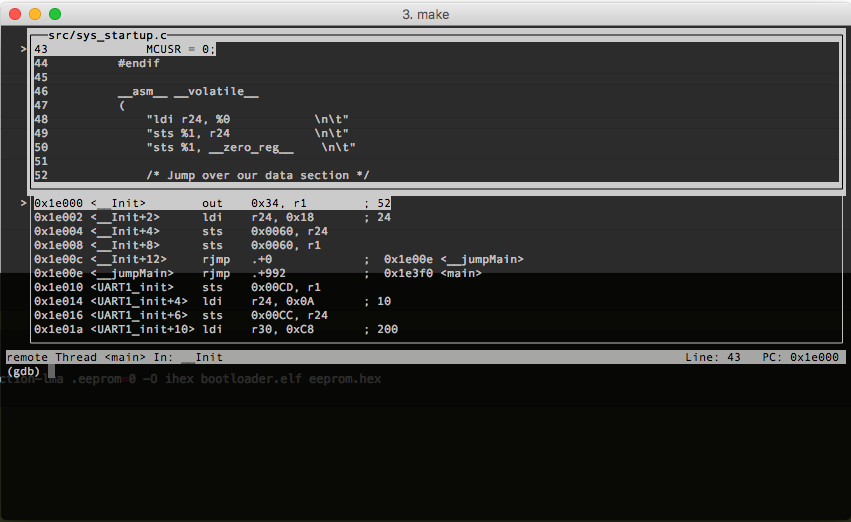

# Northeastern University ECE Department's Embedded CTF Code

This repository contains Northeastern University ECE's reference system for MITRE's 2017 
[Embedded System CTF](http://mitrecyberacademy.org/competitions/embedded/). To centralize information between our repository and MITRE's, we consolidated setup details to this document.

# High Level Design
Overall, we followed the format provided by the MITRE insecure example. We used the same 
files for our host tools and bootloader, with the exception of a loading script called 
`loadboot`, which is useful for quickly writing code to the device. 

1. `Encryption and Decryption`
   In order to encrypt and decrypt our data, we made use of Simon, a lightweight 
   block cipher designed for hardware applications. It was publically released by 
   the NSA in 2013. Click [here](https://en.wikipedia.org/wiki/Simon_(cipher)) for more information about Simon.
   On the host_tools end, we used [this](https://github.com/inmcm/Simon_Speck_Ciphers/tree/master/Python) Python 
   implementation, and on the bootloader end, we used [this](https://www.cryptolux.org/index.php/FELICS_Block_Ciphers_Detailed_Results#AVR)
   C implementation from FELICS.
   * Used in the host tools (fw_protect and readback) and the bootloader functions (load_firmware and readback)
   * Compatibility between the python variant and AVR C Simon is *non-trivial*. This requires understanding of how data is represented and conversion betweend data types between the Python and C side. Please read the source code of fw_bundle and load_firmware (in
   bootloader.c) for the complexity involved with this porting implementation through the processing of encrypted firmware frames.

2. `Integrity`
   For authentication, we used [SHA256](https://en.wikipedia.org/wiki/SHA-2), the current 
   standard used by the NSA. It is used to integrity-check the encrypted data by preventing a
   malicious user from editing the encrypted data being sent to the microcontroller. In 
   addition, since the hash can be encrypted with a secret key, it prevents a malicious user
   from creating their own hash that will be authenticated by the device. 
   On the host_tools end, we used the [hashlib](https://docs.python.org/2/library/hashlib.html) Python mode, 
   and on the bootloader, we used the [AVR Crypto-lib](https://github.com/MattiasBuelens/avr-crypto-lib) repository. 
   * Used in fw_protect and readback host tools and the bootloader functions (load firmware and readback)


# Getting Started
Before you can use the bootloader, you'll first need to get up and running
with our common development environment. All Northeastern development and testing was 
on a vagrant provisioned virtual machine.

## (MITRE COPIED) Prerequisites 
Note: if you already have one of these dependencies installed, you should not
need to install it again.

1. Download and install VirtualBox here:
   [https://www.virtualbox.org/wiki/Downloads] using the provided instructions.
2. Download and install VirtualBox Extensions (for USB support) from the same
   link: [https://www.virtualbox.org/wiki/Downloads] using the provided
   instructions.
3. Download and install Vagrant here:
   [https://www.vagrantup.com/downloads.html] using the provided instructions.
4. Download and install git here:
   [https://git-scm.com/download] using the provided instructions.

## Getting the VM Up and Running
Once you have downloaded the build environment, change into its direcotry in 
your shell and follow these steps to start up your VM:

1. Copy `Vagrantfile.team` to `Vagrantfile.local`.
2. Open `Vagrantfile.local` and ensure that the configurations make sense for
   your system configuration.
3. Run `vagrant up` in the shell/command line of your choice to download the VM
   image, provision your VM, and start it up.
4. Run `vagrant ssh` to log in to the VM.

If any errors occur during steps 3 or 4, try to resolve them by modifying
`Vagrantfile.local` rather than `Vagrantfile`.

The AVR Dragon and USB to RS232 converters should be automatically handed over
to the VM when it is running, but if they are not you should be able to attach
them through the virtualbox GUI. If you run into problems with USB that you
cannot resolve on your own, please open an issue on this repo. 

## (MITRE COPIED) Connecting the Boards
To connect the AVR Dragon to the Protostack board, use the included ribbon cable
to connect the 6-pin ISP header on the AVR Dragon to the ISP10 header on the
protostack board.  The notch on the connecting cable should face towards pin-1
on the Dragon. Do not use the 10-pin connector on the Dragon -- this is for JTAG
and is not needed to get up and running.

# Provided Files
1. `Vagrantfile`
The base configurations for vagrant. You are not allowed to modify this file.

2. `Vagrantfile.team`
This is where we added tools, dependencies, and configurations that are required 
for our development enviroment. 

3. `bootloader/`
The bootloader should be in this directory. See `bootloader/README.md` for 
bootloader-specific instructions and help.

4. `host_tools/`
The host tools should be in this directory. See `host_tools/README.md` for 
host-tool-specific instructions and help.

# Host Tools
The host tools are intended to be run from our VM. They communicate with the
bootloader over UART1 on the AVR.

## (MITRE-COPIED) How to Run the Tools
All of the example host tools are written in Python, but do not have .py file
extensions. In Linux (e.g., on your vagrant VM) you should be able to run them
as a regular program/script (i.e., `./bl_build`). If that isn't working you may
need to run them an argument to the python interpreter (i.e.,
`python bl_build`). The result will be the same either way.

All tools that take arguments should have a help flag (`-h`) that will provide
descriptions.

## (MITRE-COPIED) Checking Code Size 
To check the size of your bootloader code you can run:
`avr-size flash.hex`

Also, the file `bootloader.map` is now created when the firmware is created. It 
provides a description on where functions are located in program memory. 

## (MITRE-COPIED) Programming the Board
The following command should program your board with the output from your
`bl_build` tool:

```
avrdude -P usb -p m1284p -c dragon_isp -B 200 -u -U flash:w:flash.hex:i \
                                                 -U eeprom:w:eeprom.hex:i \
                                                 -U lfuse:w:lfuse.hex:i \
                                                 -U hfuse:w:hfuse.hex:i \
                                                 -U efuse:w:efuse.hex:i
```

Refer to the
[avrdude documentation](http://www.nongnu.org/avrdude/user-manual/avrdude.html)
for additional help with avrdude.

The AVR dragon may occasionally end up in a state where it no longer responds to
avrdude. If this happens, the problem can be resolved by disconnecting and
reconnecting the dragon's USB cable.

## (MITRE-COPIED) Makefile, Flashing and Debugging

The Makefile contains targets for both flashing and debugging the AVR as well as using the JTAG 
functionality of the Dragon. There is a number of caveats to getting this to
work. The first is that JTAG must be connected by jumpers since neither the 10-pin or 6-pin
ISP connectors on the protostack board.

Refer to the JTAG connector pinout on the Dragon Board 
[here](http://www.atmel.com/webdoc/avrdragon/avrdragon.using_ocd_physical_jtag.html) in Figure 27.

The JTAG pins connect to the AVR as follows:

| JTAG PIN  | AVR PIN  |
|:--------- |:-------- |
| TDI       | PC5      | 
| TDO       | PC4      |
| TMS       | PC3      |
| TCK       | PC2      |

NOTE: The VCC, Reset and Ground lines from the dragon must also be connected. If the 6-pin header of your 
protostack board is unpopulated, these pins are exposed on the 10-pin ISP connector. The pinout for the
10-pin ISP connector can be found [here](http://www.sunrom.com/learn/avr-isp-10-pin-for-programming)

In order to start a debug session, simply have the dragon propely connected over JTAG, then flash your 
bootloader image calling avrdude from the command line or using `make flash`. Once the bootloader has been
successfully loaded you can either run `make debug` which should open an instance of avarice by calling
`avarice -R -g :4242`  which connects  to the microcontroller, then starts/configures an instance of 
avr-gdb with the elf file full of debug symbols. 

The `avarice` and `avr-gdb` tools are now included in the `Vagrant.team` files. If you setup your VM previously,
you can run `sudo apt-get install avarice` and `sudo apt-get install gdb-avr`. Alternatively, you can run 
`vagrant up --provision	` to re-provision the VM with the new configuration.

NOTE: The specific configuration of avr-gdb is handled behind the scenes in the `.gdbinit` file.  

IMPORTANT NOTE: Debugging will ONLY work if your dragon has the latest firmware version (reported by avrdude to be 7.39) You can run `avrdude -P usb -p m1284p -c dragon_jtag -vv` to get something that looks similar to 
the following report. YOU want the `firmware_version` for the `M_MCU` and `S_MCU` to both be 7.39 as shown 
bellow. IF your dragon does not have the latest FW version you must install ATMEL Studio, connect your dragon
and protostack using the programming tools menu. From there once you read from the AVR the first time ATMEL 
studio will prompt you to update your dragon to firmware 7.xx. Update then run avrdude again to make sure
you have the proper firmware version.

```
avrdude: Version 6.0.1, compiled on Dec 16 2013 at 17:26:24
   Copyright (c) 2000-2005 Brian Dean, http://www.bdmicro.com/
   Copyright (c) 2007-2009 Joerg Wunsch

   System wide configuration file is "/usr/local/CrossPack-AVR-20131216/etc/avrdude.conf"
   User configuration file is "/Users/hgiannopoulos/.avrduderc"
   User configuration file does not exist or is not a regular file, skipping

   Using Port                    : usb
   Using Programmer              : dragon_jtag
   avrdude: jtagmkII_dragon_open()
   avrdude: usbdev_open(): Found AVRDRAGON, serno: 00A20006485C
   avrdude: jtagmkII_getsync(): Sending sign-on command: 0x86 (26 bytes msg)
   JTAG ICE mkII sign-on message:
   Communications protocol version: 1
   M_MCU:
      boot-loader FW version:        255
      firmware version:              7.39
      hardware version:              1
   S_MCU:
      boot-loader FW version:        255
      firmware version:              7.39
      hardware version:              7
   Serial number:                   00:a2:00:06:48:5c
   Device ID:                       AVRDRAGON
```

Once you run `make debug` you should get a window that looks like this:



## Disclaimer
This code is incomplete, insecure, and does not meet MITRE standards for
quality.  This code is being provided for educational purposes to serve as a
simple example that meets the minimum functional requirements for the 2017 MITRE
eCTF competition.  Use this code at your own risk!


We would like to thank MITRE for making this competition happen, and for providing a lot of the framework for this README. We appreciate having this competition; it was a lot of fun for the team and we learned a lot. 
